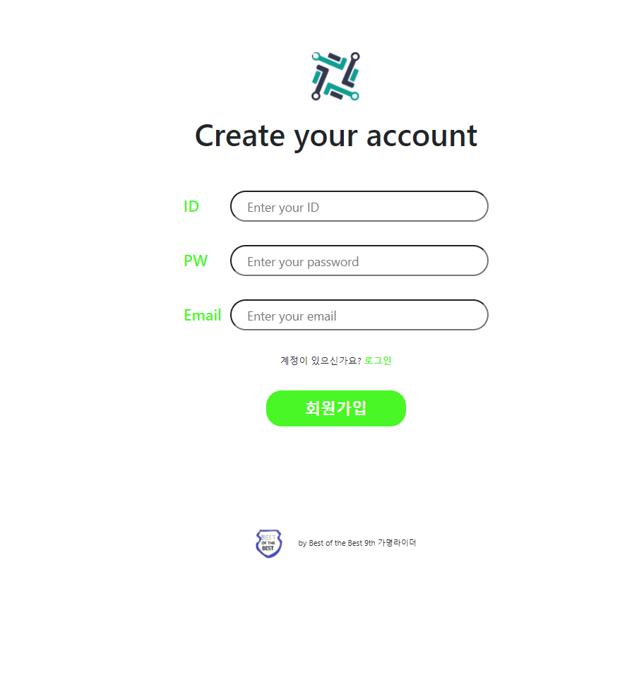
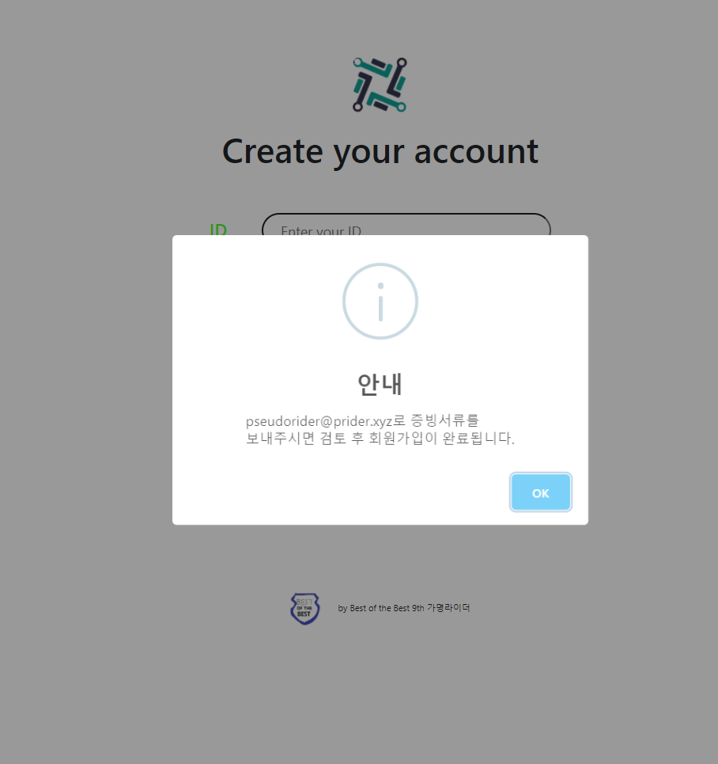
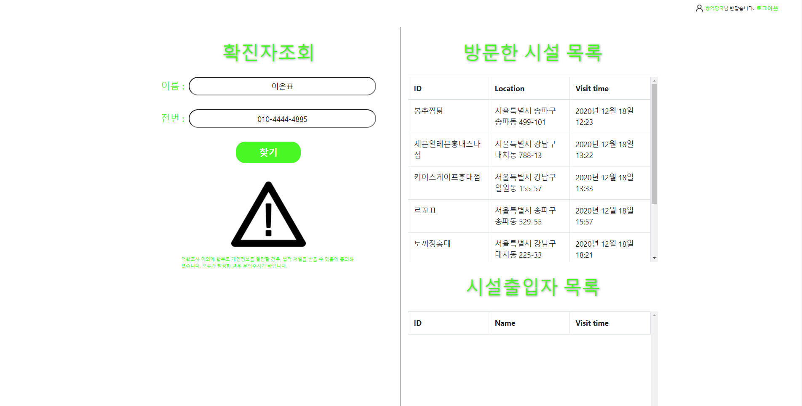
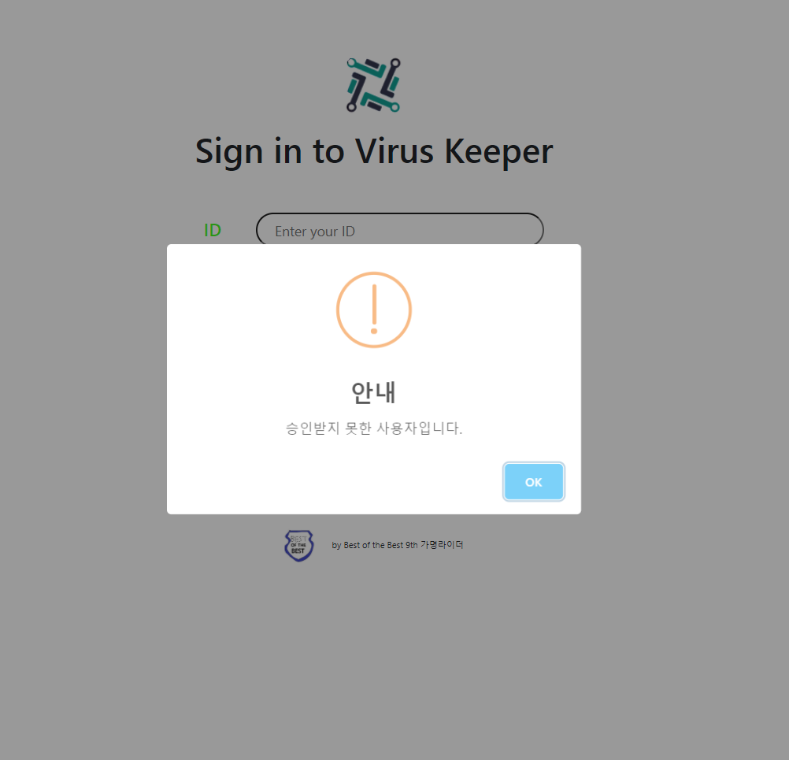
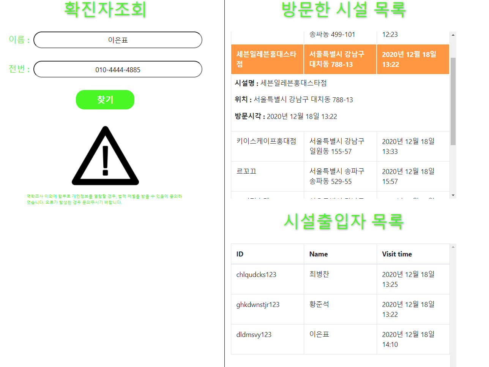

# Contact-Tracing-Web
contact-tracing tool for disease control authorities.
- Functions : Signup, Signin, Looking up info. of confirmed person, Looking up the list of facilities confirmed person visits, Looking up visiting lists of each facilities confirmed person visits
- Languages : HTML, CSS, JS (React.js)

## Scenario
The staff of Disease-Control-Authorities visits our web and requests signing up. It is accepted to get a account only when our managing team approves signing up request. After then, he can signin with authorized account. When he inputs the info.(name, phone-num) of confirmed person that are collected by epidemiological investigation, lists of facilities that confirmed person visited, visitor lists of each facilities confirmed person visited are shown through web. He can see the detail info of visitors by toggling the element of each in the list table. He can send the alert message to the close contact person by clicking the element and pushing 'Sending Alert' button.

## How to use
`npm start`
 Runs the app in the development mode.\
Open [http://localhost:3000](http://localhost:3000) to view it in the browser.

 `npm run build`
 Builds the app for production to the `build` folder.\
It correctly bundles React in production mode and optimizes the build for the best performance.

The build is minified and the filenames include the hashes.\
Your app is ready to be deployed!

See the section about [deployment](https://facebook.github.io/create-react-app/docs/deployment) for more information.
